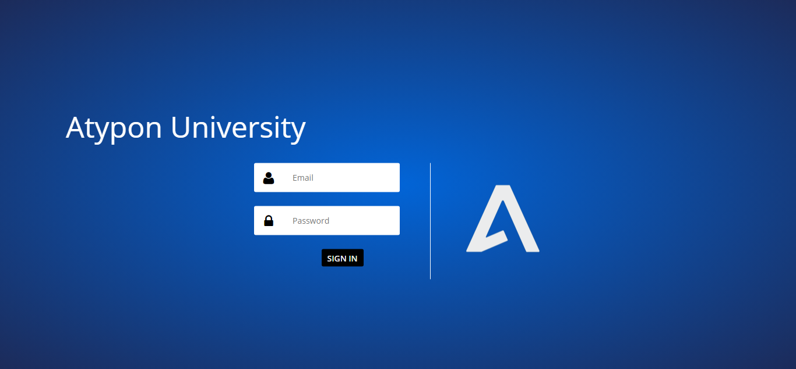
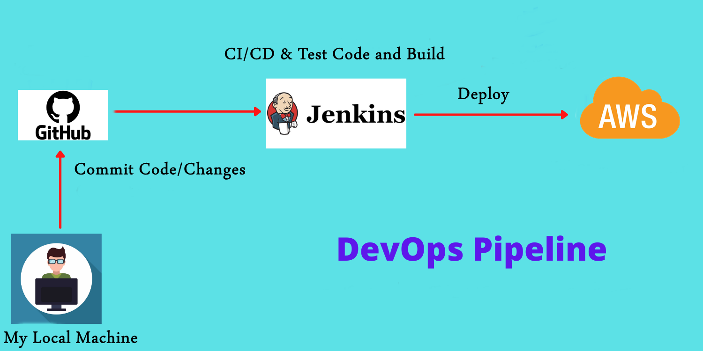
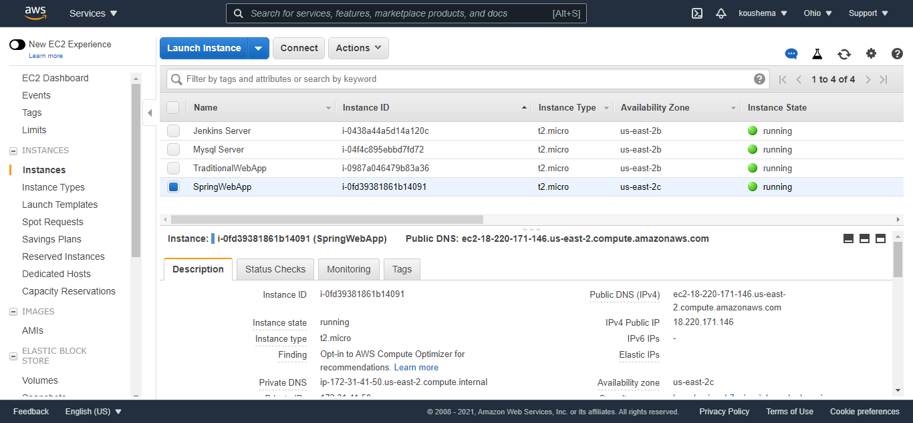
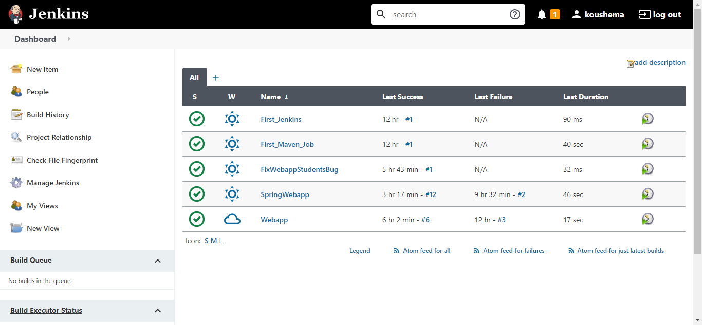
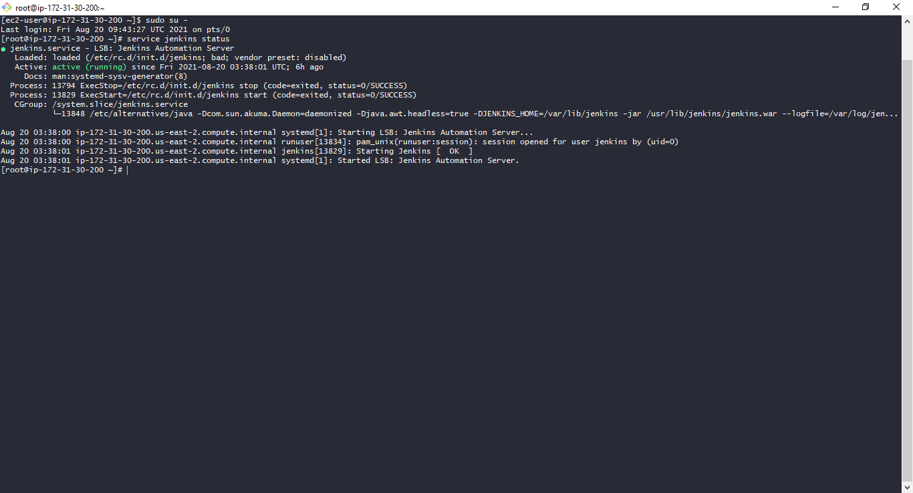

# Atypon Java and DevOps Training  
Atypon Web Project Using Spring, Spring Security, Spring Data JPA, Thymeleaf with Spring extras security extension. 

## Overview

The system has 3 levels of users: Students, Instructors, Admins. 

**Administrator**: 
- Add, Update, Delete, View all users.
- Add, Update, Delete, View all courses.
- Assign/Remove instructors to/from courses.
- Add/Remove students to/from courses.

**Instructor**: 
- Can only see their courses, students enrolled in these courses.
- Assign grades to their students.

**Student**: 
- Can only view thier courses marks.

## Technology Stack
- Java 16
- Spring Core, Boot, MVC, Security, Data JPA
- MySQL database (on a Docker Contatiner)
- Thymeleaf rendring engine and Bootstrap CSS framework for the front-end, with Thymeleaf extras for security. 
- Maven Build Tool
- Jenkins for CI/CD
- GitHub for VS
- AWS and Docker for deployment.
- SSL digital certificate to encrypt trafic and help to secure information such as user data.

## AWS 

Amazon Web Services were used in the project, as several instances were created for Jenkins Server and Web Servers.

## Jenkins

For Continuous Integration/Deployment i created a jenkins server on aws and linked it to the web servers on aws and to this GitHub repo. 

   Jenkins AWS Server Status:

### Contact

Mamoun Abu Koush - :e-mail: Mamounhayel@gmail.com

LinkedIn: [Mamoun Hayel](https://www.linkedin.com/in/mamounhayel/)

