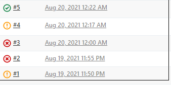
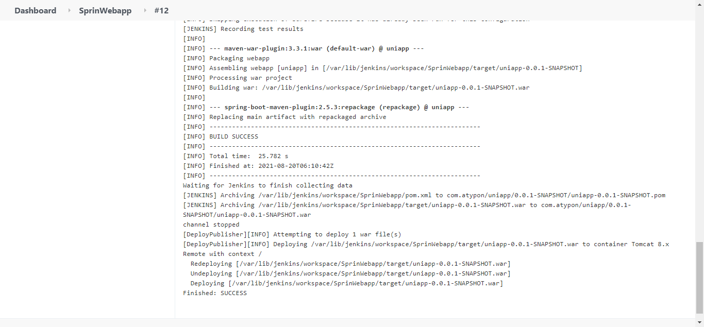
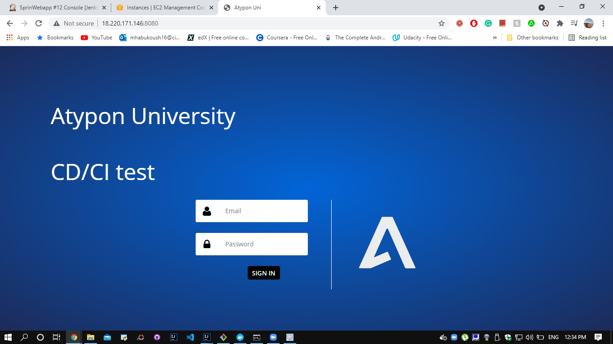
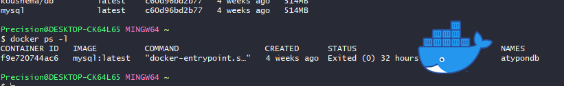
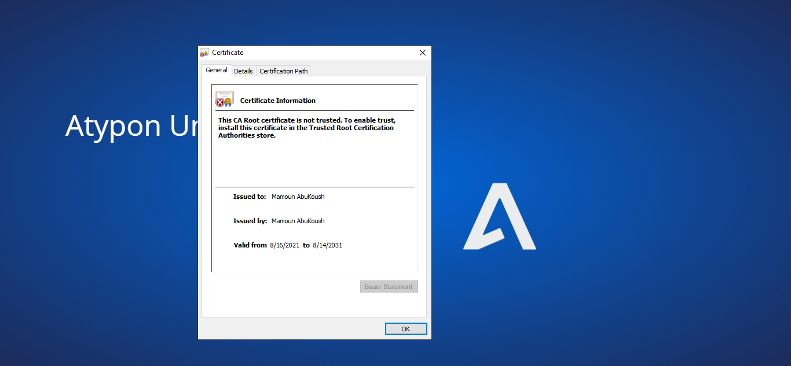

# Atypon Java and DevOps Training  
Atypon Web Project Using Spring, Spring Security, Spring Data JPA, Thymeleaf with Spring extras security extension. The same project was implementd first using traditional MVC Servlets/ JSPs click [here](https://github.com/MamounH/WebProject) to view it.

## Overview

The system has 3 levels of users: Students, Instructors, Admins. 

**Administrator**: 
- Add, Update, Delete, View all users.
- Add, Update, Delete, View all courses.
- Assign/Remove instructors to/from courses.
- Add/Remove students to/from courses.

**Instructor**: 
- Can only see their courses, students enrolled in these courses.
- Assign grades to their students.

**Student**: 
- Can only view thier courses marks.

## Technology Stack
- Java 16
- Spring Core, Boot, MVC, Security, Data JPA
- MySQL database (on a Docker Contatiner, Database Containerization)
- Thymeleaf rendring engine and Bootstrap CSS framework for the front-end, with Thymeleaf extras for security. 
- Maven Build Tool
- Jenkins for CI/CD
- GitHub for VS
- AWS and Docker for deployment.
- SSL digital certificate to encrypt trafic and help to secure information such as users data.

Simple Pipeline.

## AWS 

Amazon Web Services were used in the project, as several instances were created for Jenkins Server and Web Servers.

## Jenkins

For Continuous Integration/Deployment i created a jenkins server on aws and linked it to the web servers on aws and to this GitHub repo. 

Jenkins AWS Server Status:

Every Failure i have encountered was a closer step to sucess....

Deploying to web server: 

## Docker

Docker was used for the MySql Database, Thus providing a clean separation of concerns. Also its CI/CD Friendly.

## SSL Certificate
To enable the website to move from HTTP to HTTPS i created my own SSl Certificate using PKCS#12 as the binary format for storing the certificate chain and the private key in a single, encryptable file. RSA (Rivest–Shamir–Adleman) as the key algorithm with key size of 2048

  
   
  

## Screenshots Samples

  
  
   

  
  
   

  
  
   

For more screen shots click [here!](/Screenshots/)

### Contact

Mamoun Abu Koush - :e-mail: Mamounhayel@gmail.com

LinkedIn: [Mamoun Hayel](https://www.linkedin.com/in/mamounhayel/)

